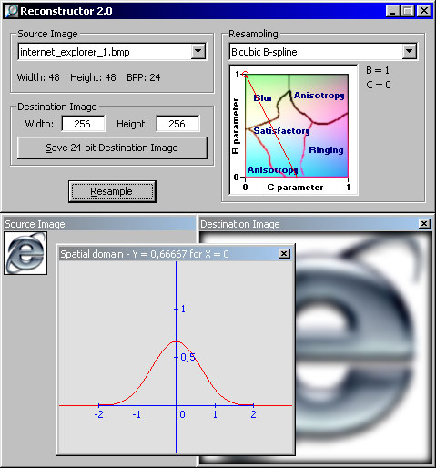

## Reconstructor 2\.0

### Description

Shows various image resampling (resizing) interpolation filters like: Nearest Neighbor (Box, Point), Bilinear (Triangle, Tent, Bartlett), Bicubic Cardinal spline, Bicubic B-spline, Bicubic BC-spline (Mitchell & Netravali) with an interactive diagram and Windowed Sinc with these windows: Bartlett, Blackman, Blackman-Harris, Bohman, Cosine, Gauss, Hamming, Hann, Kaiser, Lanczos, Parzen, Rectangular, Welch. For all interpolation filters is shown spatial domain. Everything is developed under Visual Basic using SafeArray technique to access image pixels. Application is also able to extend edges if the filter demands that by copying edges content out of bounds. Sample pictures are included.
 
### More Info
 

             |
---                |---
**Submitted On**   |2003-03-01 00:00:32
**By**             |[Petr Supina](https://github.com/Planet-Source-Code/PSCIndex/blob/master/ByAuthor/petr-supina.md)
**Level**          |Beginner
**User Rating**    |5.0 (85 globes from 17 users)
**Compatibility**  |VB 6\.0
**Category**       |[Graphics](https://github.com/Planet-Source-Code/PSCIndex/blob/master/ByCategory/graphics__1-46.md)
**World**          |[Visual Basic](https://github.com/Planet-Source-Code/PSCIndex/blob/master/ByWorld/visual-basic.md)
**Archive File**   |[Reconstruc155267312003\.zip](https://github.com/Planet-Source-Code/petr-supina-reconstructor-2-0__1-43652/archive/master.zip)

